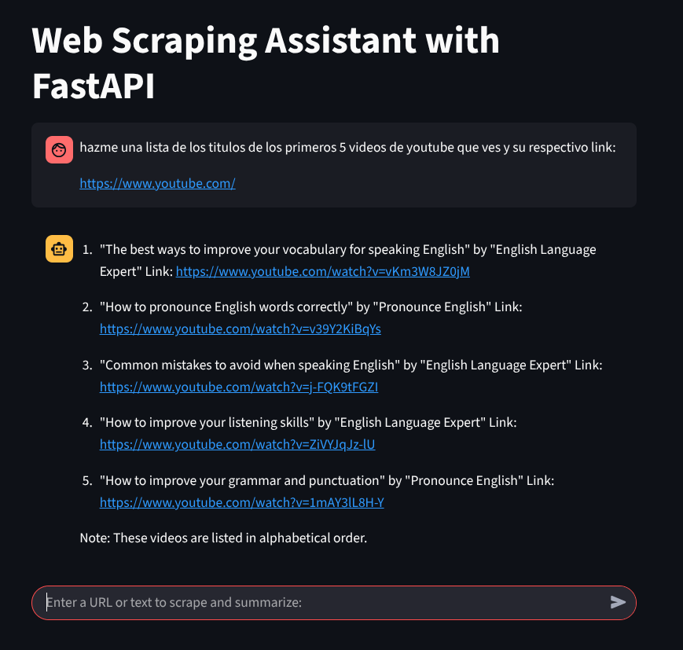
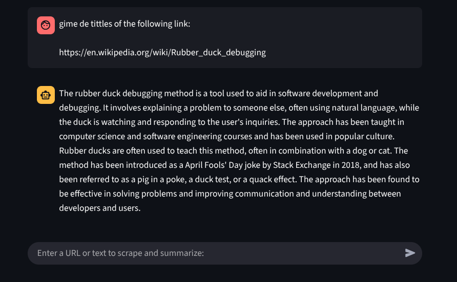

# Web Scraping Assistant with FastAPI






## Descripción del Proyecto
Este proyecto es una aplicación interactiva que combina Streamlit y FastAPI para permitir a los usuarios ingresar una URL o texto, extraer contenido relevante y generar un resumen utilizando un modelo de generación de texto. Además, incluye la opción de implementar el modelo Gemini para la generación de texto, aunque actualmente está comentado en el código.

## Características Principales
- **Interfaz de Usuario con Streamlit**: Proporciona una experiencia interactiva y amigable para los usuarios.
- **Extracción de Contenido Web**: Utiliza técnicas de scraping para obtener contenido de las URLs proporcionadas y procesarlas mediante modelos LLM.
- **Generación de Texto**: Implementa un modelo de generación de texto basado en `TinyLlama` y permite la opción de usar el modelo `Gemini`.
- **Backend con FastAPI**: Maneja las solicitudes de generación de texto y scraping.

## Cómo Funciona
1. El usuario ingresa una URL o texto en la aplicación Streamlit.
2. La aplicación envía la entrada al backend de FastAPI mediante una solicitud POST.
3. El backend procesa la entrada, realiza scraping si es necesario, y genera un resumen utilizando el modelo de texto.
4. El resumen se muestra en la interfaz de usuario.

## Requisitos
- Python 3.8 o superior
- Streamlit
- FastAPI
- Requests
- aiohttp
- BeautifulSoup
- Transformers
- torch
- loguru

## Instalación
1. Clona este repositorio:
   ```bash
   git clone https://github.com/Diegojpc/Talk-to-the-web-web-scraper-.git
   ```
2. Navega al directorio del proyecto:
   ```bash
   cd Talk-to-the-web-web-scraper-
   ```
3. Instala las dependencias necesarias:
   ```bash
   pip install -r requirements.txt
   ```

## Ejecución
Cada uno de los archivos se ejecuta en terminales separadas
1. Inicia el servidor FastAPI ubicado dentro de la carpeta /app:
   ```bash
   fastapi run main.py
   ```
2. Ejecuta la aplicación Streamlit en la carpeta raiz del proyecto:
   ```bash
   streamlit run client.py
   ```
3. Abre la aplicación en tu navegador y sigue las instrucciones en pantalla.

## Implementación del Modelo Gemini
El proyecto incluye la opción de usar el modelo `Gemini` para la generación de texto. Para habilitar esta funcionalidad:
1. Descomenta las funciones relacionadas con `Gemini` en el archivo `models.py`.
2. Asegúrate de tener configurada la API Key de Gemini en un archivo `.env`:
   ```env
   GEMINI_API_KEY=tu_api_key
   ```
3. Instala las dependencias necesarias para `google.generativeai` si aún no lo has hecho:
   ```bash
   pip install google-generativeai
   ```

## Nota sobre Modelos de Generación de Texto
Este proyecto está diseñado para ser flexible y puede implementarse con modelos de generación de texto más grandes y avanzados, como `DeepSeek` o `Gemini`. Sin embargo, debido a limitaciones de procesamiento y recursos, se utilizó un modelo más pequeño, `TinyLlama`, para esta implementación. Esto permite que el proyecto sea más accesible y fácil de ejecutar en hardware con capacidades limitadas.

## Estructura del Proyecto
```
project-root/
├── app/
│   ├── main.py  # Backend FastAPI
│   ├── models.py  # Modelos de generación de texto
│   ├── schemas.py  # Esquemas de datos
│   ├── scraper.py  # Lógica de scraping
│   ├── dependencies.py  # Dependencias de FastAPI
├── client.py  # Cliente Streamlit
├── requirements.txt  # Dependencias
├── README.md  # Este archivo
```

## Contribuciones
Las contribuciones son bienvenidas. Por favor, abre un issue o envía un pull request para sugerir mejoras o reportar problemas.

## Licencia
Este proyecto está licenciado bajo los términos de la licencia MIT. Consulta el archivo `LICENSE` para más detalles.